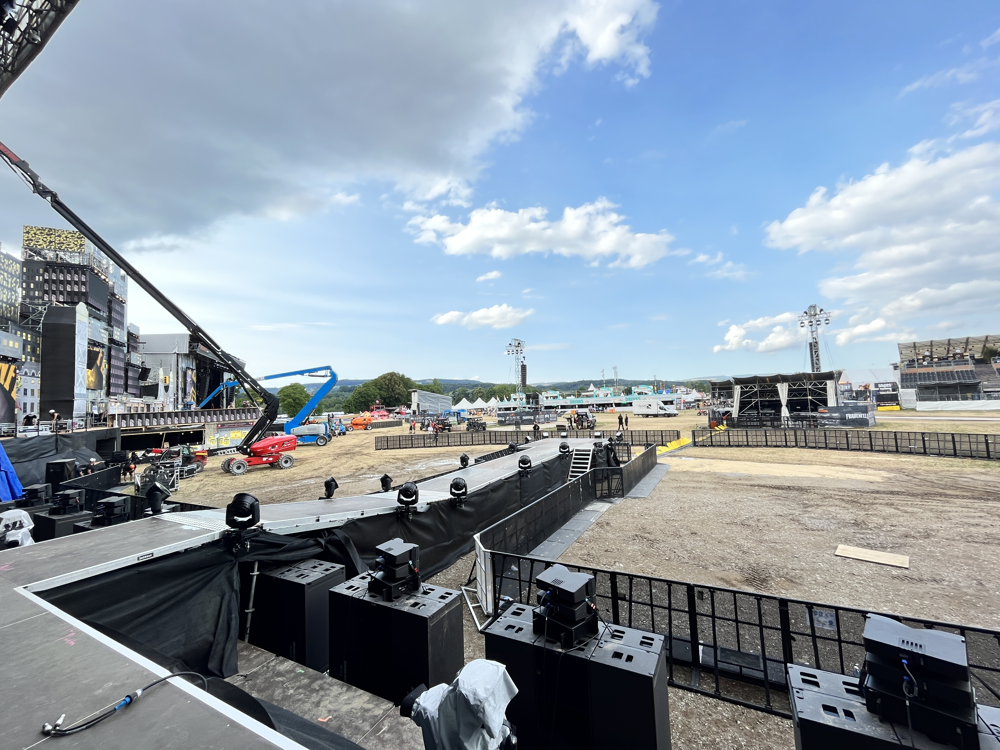

## Project Overview
I was responsible with my team for building the network infrastructure for all food and beverage locations at the Openair Frauenfeld 2023 festival.
With of our partner company [Konzept5](https://konzept5.ch) we installed more than 50 Cisco Switches and round about 30 Access Points. 

### Network Setup Details
- Designed and implemented a reliable network for seamless operations at all food and beverage stalls.
- Provided public WiFi for VIP areas.
- Set up public WiFi at the Swisscom stand.
- Ensured backstage internet connectivity for staff and performers.
- Facilitated video and CCTV transports for security and monitoring.
- Established internet connectivity for ticketing systems.
- Ensured high-speed internet and secure payment processing.

### Image Gallery

### LinkedIn Post
Checkout this [LinkedIn](https://www.linkedin.com/feed/update/urn:li:activity:7112344709221474304) post.

> Photo by [Pablo Wynistorf](https://www.pablo.one)

