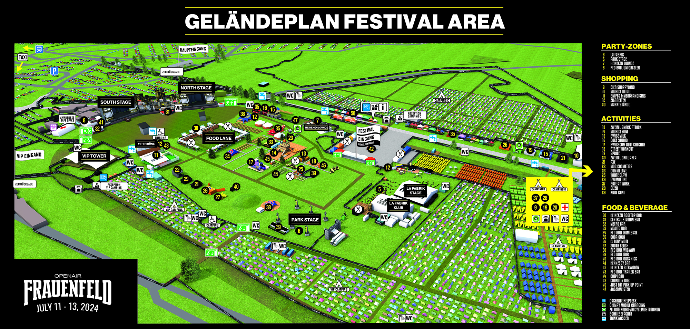
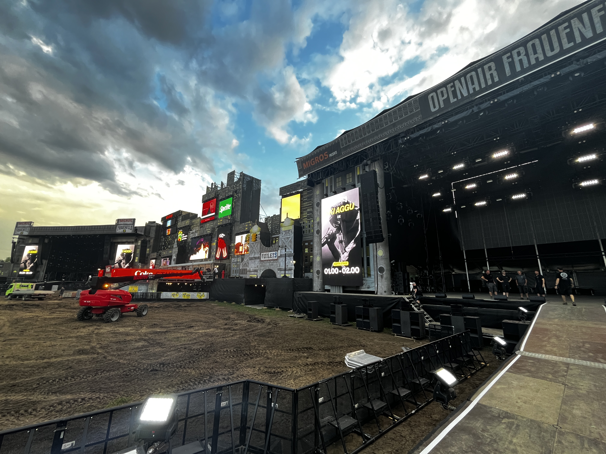
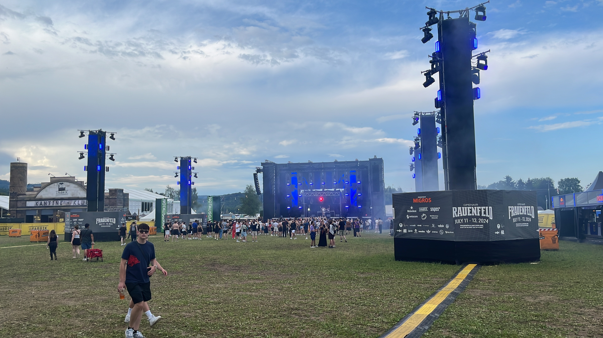

## Project Overview

At the Openair Frauenfeld 2024, we were tasked with an ambitious mission: to create a state-of-the-art network infrastructure across the festival grounds, ensuring seamless connectivity for thousands of attendees. Collaborating closely with our partner company [Konzept5](https://konzept5.ch), we deployed an extensive array of networking equipment, including over 50 Cisco Switches and approximately 30 Access Points, all interconnected via a robust mix of fiber and copper cabling. This setup powered a variety of critical services, from public WiFi to backstage communications, ensuring the festival ran smoothly.

The festival layout was vast and complex, as shown below:

### Network Setup Details

- **Food and Beverage Operations:** Designed a reliable network infrastructure to support seamless service across all stalls.
- **VIP Connectivity:** Provided dedicated public WiFi for VIP areas, enhancing their festival experience.
- **Swisscom Stand:** Set up a public WiFi network, showcasing the capabilities of Swisscom's services.
- **Backstage Internet:** Ensured robust internet connectivity for staff and performers, facilitating smooth operations.
- **Security and Monitoring:** Facilitated the transport of video and CCTV feeds for comprehensive security coverage.
- **Ticketing Systems:** Established secure internet connections for ticketing operations, supporting efficient entry management.
- **Payment Processing:** Enabled high-speed internet for secure payment transactions, ensuring quick and safe service for attendees.

### Image Gallery

A glimpse into the technical and scenic aspects of the festival:

### LinkedIn Post

Discover more about our network setup at the festival in this [LinkedIn post](https://www.linkedin.com/feed/update/urn:li:activity:7216422673751437314).

> Photo by [Pablo Wynistorf](https://www.pablo.one)

> Titel image by [baselundregion.ch](https://baselundregion.ch/2023/06/22/von-basel-nach-frauenfeld-das-openair-frauenfeld-vom-06-bis-08-juli-2023/)
