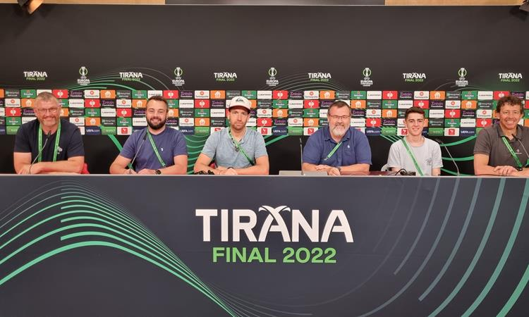
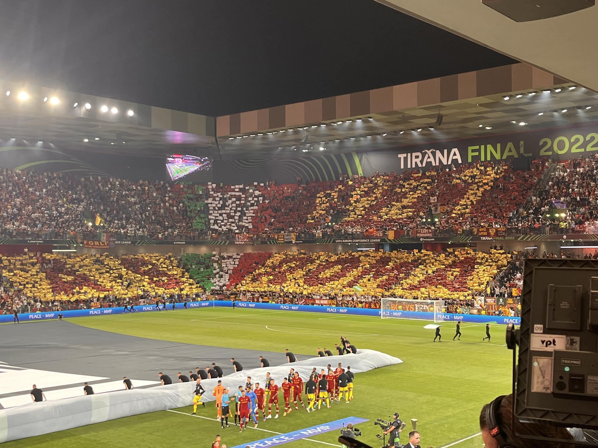
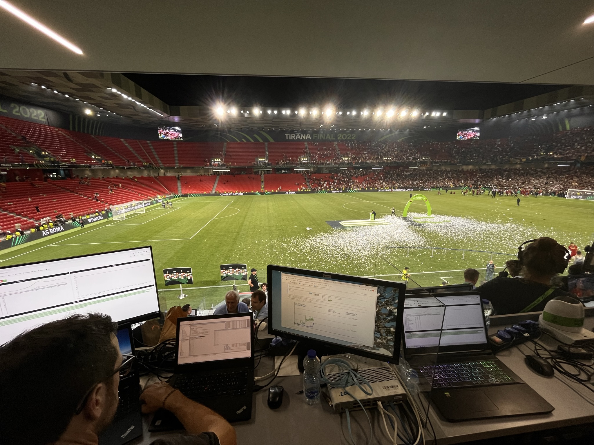
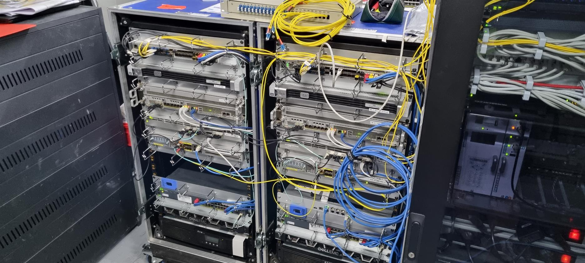

## Project Overview

At the prestigious UEFA Conference League Final 2022 held in Tirana, our team played a crucial role in ensuring seamless connectivity for various stakeholders. We were entrusted with the critical task of establishing a comprehensive network infrastructure across the stadium. Our responsibilities spanned from providing robust network services for photographers on the pitch to setting up dedicated networks for media personnel in the media tribune and secure connectivity for all UEFA employees.

### Network Setup Details

- **Pitch-Side Network:** Implemented a reliable network for photographers on the pitch, enabling fast and secure transmission of photos and data.
- **Media Tribune:** Established a high-speed network for all media personnel, ensuring uninterrupted coverage and reporting.
- **UEFA Employee Network:** Provided a dedicated network for UEFA employees, supporting their operational needs throughout the event.

### Image Gallery

### Intranet Post
[Intranet Post (For Swisscom Employees only)](https://intranet.swisscom.com/home/articles/tgeduj04/uefa_conference_league)

> Photo by [Pablo Wynistorf](https://www.pablo.one)

