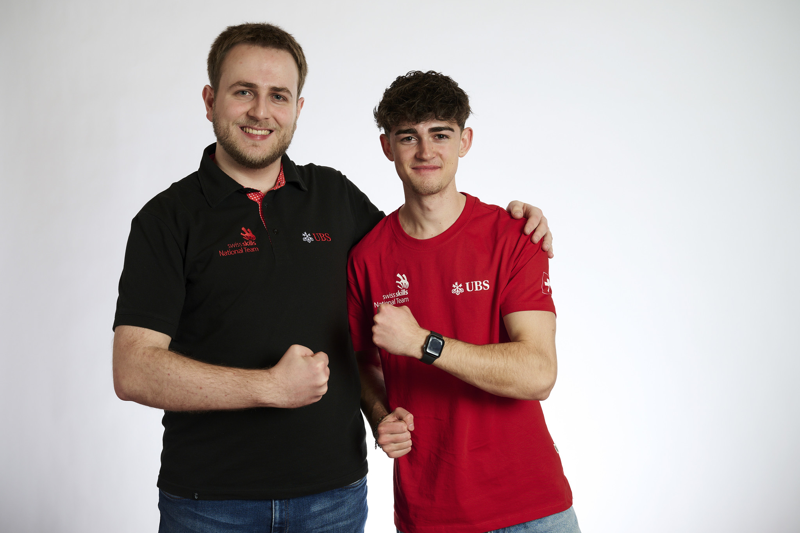
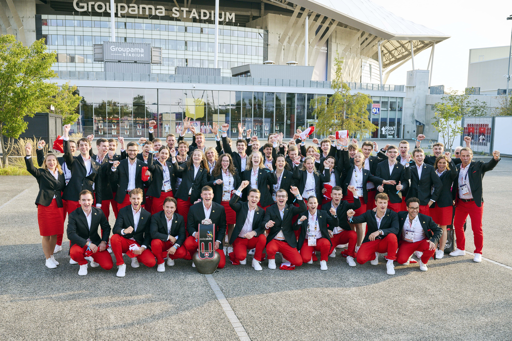
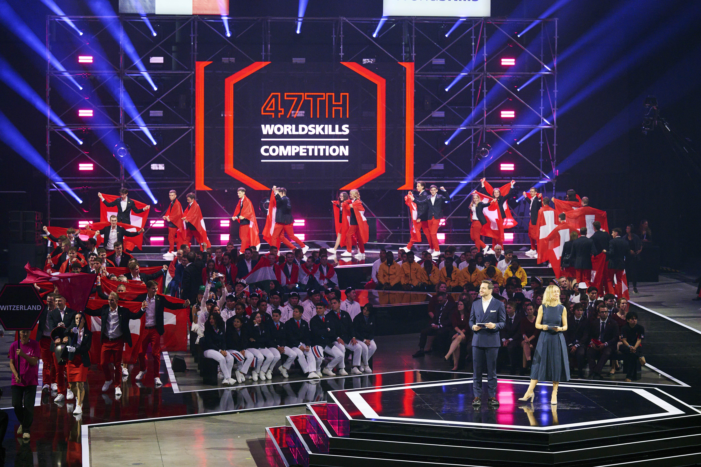
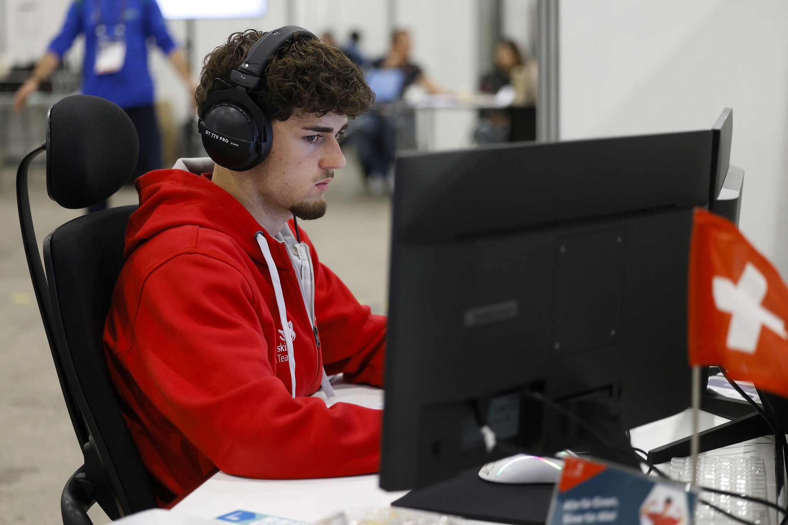

## Project Overview

WorldSkills is a global competition that brings together skilled professionals from around the world to showcase their abilities across various trades and professions. Held every two years, the event sees participants from over 80 countries competing in skill areas ranging from engineering and information technology to arts and design. The goal is to inspire and raise the standards of vocational skills worldwide, celebrating the dedication and expertise of young professionals.

At WorldSkills Lyon 2024, I had the honor of representing Switzerland in the Cloud Computing category. Over four days, I participated in a series of challenging tasks on the AWS platform, demonstrating skills in designing, deploying, and managing cloud infrastructure solutions. The competition required a deep understanding of cloud architecture, networking, security, and automation to solve real-world scenarios efficiently. I tackled tasks such as configuring secure networks, managing databases, setting up scalable infrastructure, and deploying automated workflows, all while adhering to well-architected principles to ensure efficiency, reliability, and cost-effectiveness. My performance, which reflected technical expertise and dedication, earned me a medallion for excellence.

## My experiences
For me, participating in WorldSkills Lyon 2024 was truly a once-in-a-lifetime experience. My journey began in January 2024, when I started preparing for the competition with the guidance of my coach, [Pascal Mathis](https://www.linkedin.com/in/ppmathis/). Together, we developed a rigorous training plan to ensure I was ready for the challenges ahead. This preparation included extensive hands-on practice, studying a wide range of AWS services, participating in diffrent AWS Jam and AWS Gameday sessions as well as refining my problem-solving and architecting skills.

To build my confidence and gain exposure, I participated in multiple demo competitions throughout the year. One of the most memorable was a 3-day test competition in Ireland, where I had the opportunity to compete against more than half of my eventual WorldSkills competitors. It was an invaluable experience that allowed me to test my skills under pressure, identify areas for improvement, and connect with peers from around the world. These experiences were essential in shaping my approach and mindset for the main event in Lyon.

During the entire year of preparation, I had the privilege of participating in several team weekends with the SwissSkills National Team. These gatherings were more than just training sessions; they were an opportunity to build camaraderie, share experiences, and learn from other skilled professionals across various trades. Each weekend was filled with intense training, team-building activities, and valuable insights from coaches and past competitors.

Working alongside such a talented group of individuals was inspiring, and it helped me understand the importance of collaboration and adaptability. These weekends not only improved my technical skills but also fostered a strong sense of unity and national pride, reminding me that I was part of something bigger—representing Switzerland on the global stage.

## Best of Worldskills Lyon 2024


### LinkedIn Post
[LinkedIn post](https://www.linkedin.com/feed/update/urn:li:activity:7242602929466093568).

### Image Gallery

